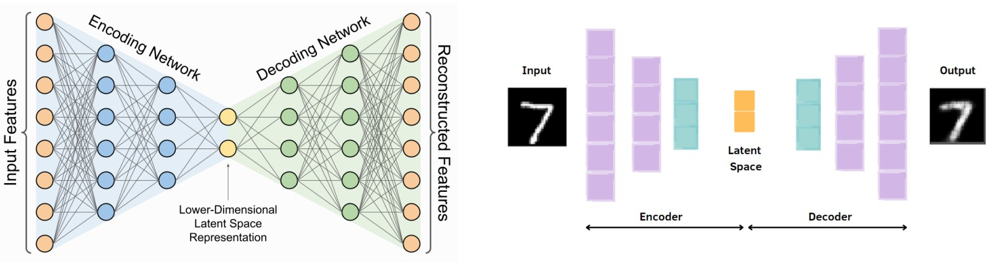
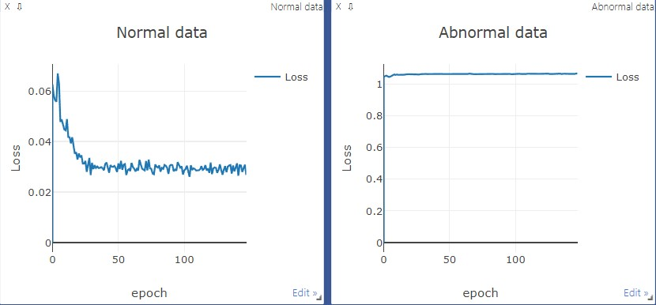
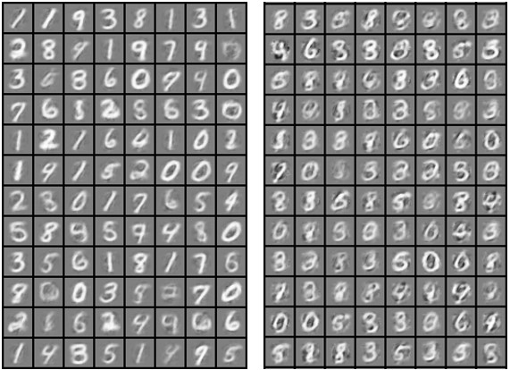

# Anomaly Detection

1. Density-based Anomaly Detection
2. Distance-based Anomaly Detection
3. **Model-based Anomaly Detection** (●)

---

This time, we are going to proceed with a tutorial on anomaly detection using autoencoder.

Before diving into the tutorial, what is an autoencoder?

- An autoencoder is an artificial neural network that compresses the input data as much as possible when an input is received and then restores the compressed data back to the original input form. 
- The part that compresses the data is called an encoder, and the part that restores the data is called a decoder. The meaningful data z extracted during the compression process is called a latent vector.

<p align='center'></p>

---

**python tutorial**

- hypothesis : The autoencoder will have a very low MSE value when normal data comes in. On the other hand, when abnormal data comes in, a high MSE value is derived.

- Since learning was conducted to reduce the difference between the input and output of normal data, of course, if it was well learned, the MSE value according to the input of normal data would get a very low value.

- MNIST data sets is used, and fake images were created for train and inference . MSE Loss was used as the loss function and Adam was used as the optimizer to perform training. As a final result, check the loss plot between the normal image and the abnormal image. In addition, it can be seen that abnormality is detected by checking the distribution of normal and abnormal data.

```
def main():

    args = get_args()

    img_transform = transforms.Compose([
        transforms.ToTensor()
    ])

    dataset = MNIST('./data',transform=img_transform)
    dataloader = DataLoader(dataset, batch_size=args.batch_size, shuffle = True)

    train_fake_img = make_noisy_data('train')
    test_fake_img = make_noisy_data('test')

    model = AE()
    model.to(args.device)
    criterion = nn.MSELoss()
    optimizer = torch.optim.Adam(model.parameters(), lr=args.lr, weight_decay=args.w_d)

    trainer = Trainer(args,train_fake_img,dataloader,model,criterion,optimizer)
    trainer.train()
    tester = Tester(args,test_fake_img,dataloader,model)
    tester.test()

if __name__ == '__main__':
    main()
```

- [AutoEncoder](https://github.com/junginkim23/Business_Analytics_tutorial/blob/master/Anomaly_Detection/utils/AE.py)  
    - Six linear layers are stacked on each of the encoder and decoder, and the relu function is used in the encoder and the tanh activation function is used in the decoder.

```
class AE(nn.Module):
    def __init__(self):
        super(AE, self).__init__()
        self.enc = nn.Sequential(
            nn.BatchNorm1d(num_features=28*28),
            nn.Linear(784, 512),
            nn.ReLU(),
            nn.Linear(512, 256),
            nn.ReLU(),
            nn.Linear(256, 128),
            nn.ReLU(),
            nn.Linear(128, 64),
            nn.ReLU(),
            nn.Linear(64, 32),
            nn.ReLU(),
            nn.Linear(32, 16),
            nn.ReLU()
        )
        self.dec = nn.Sequential(
            nn.Linear(16, 32),
            nn.Tanh(),
            nn.Linear(32, 64),
            nn.Tanh(),
            nn.Linear(64, 128),
            nn.Tanh(),
            nn.Linear(128, 256),
            nn.Tanh(),
            nn.Linear(256, 512),
            nn.Tanh(),
            nn.Linear(512, 784),
            nn.BatchNorm1d(num_features=28*28),
            nn.Tanh()
        )
    def forward(self, x):
        encode = self.enc(x)
        decode = self.dec(encode)
        return decode
```

- [train](https://github.com/junginkim23/Business_Analytics_tutorial/blob/master/Anomaly_Detection/utils/train.py) 

    - Learning is performed with 60,000 normal data, and additional learning is performed with data mixed with some noise.

    - It trains for a total of 160 epochs and stores the weights of the trained model every 20 epochs. In addition, by recording the loss every epoch while learning is in progress, you can check the loss after learning is finished. As can be seen from the results, in the case of fake images, the loss is maintained without being reduced, but in the case of normal images, it is confirmed that the loss is reduced. Finally, a model that has run all 160 epochs is used.

```
def train(self):
        self.model.train()

        for epoch in range(self.args.epochs):
            start = time.time()
            for data in self.loader:
                img, _ = data
                img = img.view(img.size(0), -1)
                img = Variable(img).cuda()

                pred = self.model(img)

                loss = self.criterion(pred,img)
                self.optimizer.zero_grad()
                loss.backward()
                self.optimizer.step()
            
            print(f'epoch [{epoch+1}/{self.args.epochs}] | loss:{float(loss.data):.4f} | Time {time.time()-start:.4f}')
            self.vis.line(Y=[loss.data.cpu().numpy()], X=np.array([epoch]),win=self.normal,update='append')

            if epoch % 10 ==0 :
                pic = self.to_img(pred.cpu().data)
                save_image(pic, os.path.join(self.args.save_img_dir,f'./real_image_{epoch}.png'))

            pred_ab = self.model(self.fake_imgs)
            
            loss = self.criterion(pred_ab, self.fake_imgs)

            self.optimizer.zero_grad()
            loss.backward()
            self.optimizer.step()

            print(f'fake epoch [{epoch+1}/{self.args.epochs}] | loss:{float(loss.data):.4f} | Time {time.time()-start:.4f}')
            self.vis.line(Y=[loss.data.cpu().numpy()], X=np.array([epoch]), win=self.abnormal, update='append')

            if epoch % 10 == 0:
                pic = self.to_img(pred_ab.cpu().data)
                save_image(pic, os.path.join(self.args.save_img_dir,f'./fake_image_{epoch}.png'))
            
            if (epoch+1)%20==0:
                self._save_model(epoch)

## output 
epoch [1/160] | loss:0.0668 | Time 13.9934
fake epoch [1/160] | loss:1.0412 | Time 14.0524
epoch [2/160] | loss:0.0597 | Time 12.5840
fake epoch [2/160] | loss:1.0402 | Time 12.6000
epoch [3/160] | loss:0.0520 | Time 12.7024
fake epoch [3/160] | loss:1.0407 | Time 12.7204
epoch [4/160] | loss:0.0467 | Time 12.6946
fake epoch [4/160] | loss:1.0529 | Time 12.7116
epoch [5/160] | loss:0.0416 | Time 12.7174
fake epoch [5/160] | loss:1.0530 | Time 12.7404
epoch [6/160] | loss:0.0408 | Time 12.5694
fake epoch [6/160] | loss:1.0539 | Time 12.6254
epoch [7/160] | loss:0.0386 | Time 12.6462
fake epoch [7/160] | loss:1.0569 | Time 12.6672
epoch [8/160] | loss:0.0406 | Time 12.5580
fake epoch [8/160] | loss:1.0585 | Time 12.5770
```

<p align='center'></p>

- Results of normal and fake images reconstructed using a model trained for 10 epochs and 160 epoch

- epoch 10 

<p align='center'></p>

- epoch 150
<p align='center'></p>

- [inference](https://github.com/junginkim23/Business_Analytics_tutorial/blob/master/Anomaly_Detection/utils/test.py) 

    - For inference, we use the model trained for 160 epochs and check the MSE displot of normal and fake images. The figure below confirms that the two data are well separated.
    - In the figure, 0 corresponds to a normal image and 1 corresponds to a fake image.
```
def test(self):
        save_file = os.path.join(self.args.ckpt_dir,f'epoch{self.args.epochs}.pt')
        ckpt = torch.load(save_file)
        self._load_model(ckpt)

        with torch.no_grad():
            self.model.eval()

            # fake img
            pred_ab = self.model(self.fake_imgs)
            fake = (self.fake_imgs-pred_ab).data.cpu().numpy()
            fake = np.sum(fake**2, axis=1)
            print(f'fake img loss 최대값 : {fake.max()}')

            # normal img
            img = self.loader.dataset.data
            img = img.view(img.size(0),-1)
            img = img.type('torch.cuda.FloatTensor')
            img = img / 255

            pred = self.model(img)

            real = (img - pred).data.cpu().numpy()
            real = np.sum(real**2,axis=1)
            print(f'normal img loss 최대값 : {real.max()}')

        self.make_plt(real,fake)

## output
fake img loss 최대값 : 1.2667418718338013
normal img loss 최대값 : 0.2981035113334656
```
<p align='center'></p>

Conclusion 

- Using MNIST data as normal and randomly creating fake img as abnormal, the distribution difference between normal and abnormal is clearly visible. However, if there is something to be desired, I wanted to evaluate the performance of the model itself with an appropriate threshold by obtaining an anomaly score with the value obtained by calculating the MSE loss function between the input image and the restored image, but It was difficult to try because the distribution of MSE loss values ​​for normal and abnormal data was too different. Although I couldn't do it in this tutorial, I plan to try it before the end of this semester.