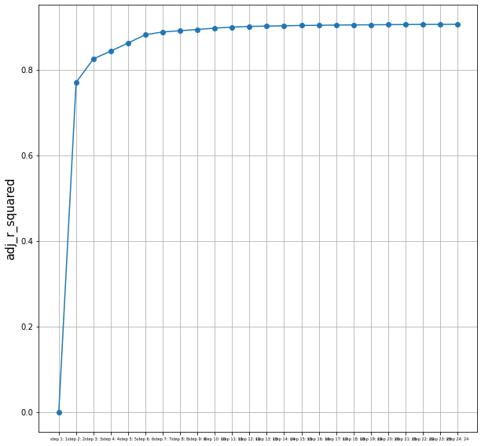
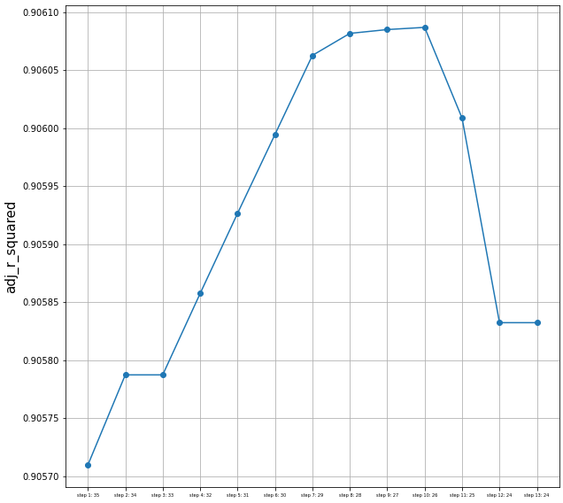

## 📝 Python Tutorial - Forward_Selection, Backward Elimination, Stepwise Selection

`Procedure`

1. Forward Selection 
2. Backward Elimination
3. Stepwise Selection

---

**Dataset** : ToyotaCorolla dataset --> FS, BS, SS에 모두 공통으로 사용

1. Forward Selection 


### Step 1. 데이터 전처리 진행
```
data = pd.read_csv('./ToyotaCorolla.csv')

X = data.drop(columns = {'Price','Id', 'Model'})
y = data['Price']

X_train, X_test, y_train, y_test = train_test_split(X, y, test_size=0.2, shuffle=True, random_state=1225)

X_train =pd.get_dummies(X_train)
X_test = pd.get_dummies(X_test)
```

### Step 2. forward selection 정의 및 수행 
```
def forward_selection(X,y):
   
    variables = X 
    y = y
  
    forward_variables = []
    sv_per_step = [] 
    adj_r_squared_list = []
    steps = []
    
    sl_enter = 0.05
    sl_remove = 0.05
    step = 0

    while len(variables) > 0:
        remainder = list(set(variables) - set(forward_variables))
        pval = pd.Series(index=remainder)
        
        for col in remainder: 
            X_train = X[forward_variables+[col]]
            X_train = sm.add_constant(X_train)
            model = sm.OLS(y,X_train).fit(disp=0)
            pval[col] = model.pvalues[col]
    
        min_pval = pval.min()
        if min_pval < sl_enter: 
            forward_variables.append(pval.idxmin())            
            step += 1
            steps.append(step)
            adj_r_squared = sm.OLS(y,sm.add_constant(X[forward_variables])).fit(disp=0).rsquared_adj
            adj_r_squared_list.append(adj_r_squared)
            sv_per_step.append(forward_variables.copy())
        else:
            break
    return forward_variables, steps, adj_r_squared_list, sv_per_step

print(sv_per_step)
['Mfg_Year'],
 ['Mfg_Year', 'Cylinders'],
 ['Mfg_Year', 'Cylinders', 'Automatic_airco'],
 ['Mfg_Year', 'Cylinders', 'Automatic_airco', 'HP'],
 ['Mfg_Year', 'Cylinders', 'Automatic_airco', 'HP', 'Weight'],
 ['Mfg_Year', 'Cylinders', 'Automatic_airco', 'HP', 'Weight', 'KM']
                                 .
                                 .
                                 .
최종 선택 변수: ['Mfg_Year','Cylinders','Automatic_airco','HP','Weight','KM','Powered_Windows',
'Quarterly_Tax','Fuel_Type_Petrol','Guarantee_Period','BOVAG_Guarantee',
'Sport_Model','Mfr_Guarantee','Backseat_Divider','CD_Player','Tow_Bar', 'Boardcomputer','Mfg_Month','Age_08_04','Airco','ABS','Fuel_Type_CNG', 'Automatic', 'Metallic_Rim']
```

### 각 step 별 선택된 변수의 조정 R 제곱 값에 대한 plot 



2. Backward Elimination (BE)

후방 소거법 정의 및 수행 
```
def backward_elimination(X, y, threshold_out = 0.05):
    
    feature_list = X.columns.tolist()
    backward_feature = feature_list 
    variable_per_step = [] 
    adj_r_squared_list = []
    steps = []
    step = 0
    
    while True:
        changed=False
        model = sm.OLS(y, sm.add_constant(pd.DataFrame(X[feature_list]))).fit(disp=0)
        pvalues = model.pvalues.iloc[1:] 
        worst_pval = pvalues.max()	
        if worst_pval > threshold_out:
            changed=True
            worst_feature = pvalues.idxmax()
            backward_feature.remove(worst_feature)
        
        step += 1
        steps.append(step)        
        adj_r_squared = sm.OLS(y, sm.add_constant(pd.DataFrame(X[feature_list]))).fit(disp=0).rsquared_adj
        adj_r_squared_list.append(adj_r_squared)
        variable_per_step.append(backward_feature.copy())
        
        if not changed:
            break
      
    return backward_feature,steps,adj_r_squared_list,variable_per_step

최종 선택 변수 
[Age_08_04,Mfg_Month,Mfg_Year,KM,HP,Automatic,Cylinders,Quarterly_Tax,Weight
Mfr_Guarantee,BOVAG_Guarantee,Guarantee_Period,ABS,Airco,Automatic_airco
Boardcomputer,CD_Player,Powered_Windows,Sport_Model,Backseat_Divider,Metallic_Rim,Tow_Bar,Fuel_Type_CNG,Fuel_Type_Petrol]
```

### 각 step 별 선택된 변수의 조정 R 제곱 값에 대한 plot 
