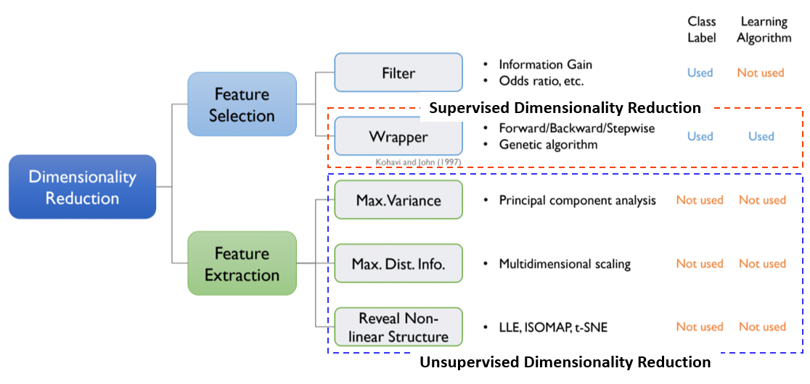
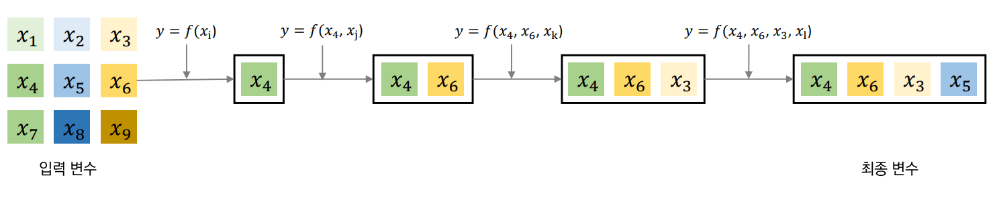
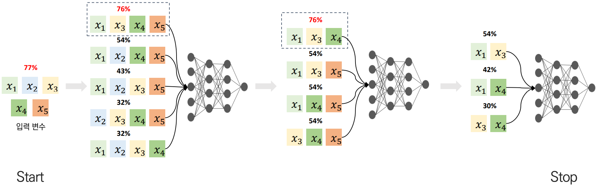
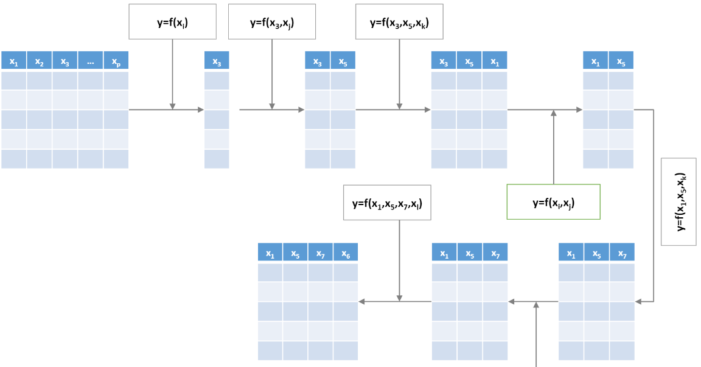
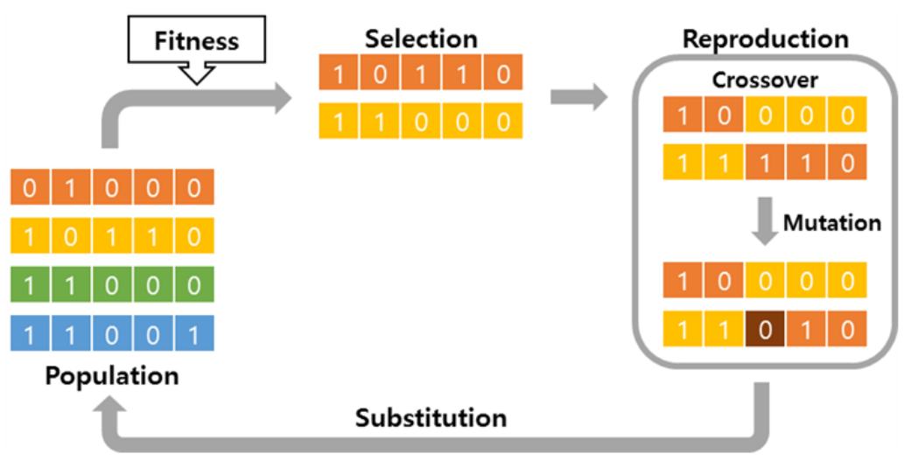

## Dimensionality Reduction 

1. 차원 축소란?
2. Python tutorial 
    * 지도 학습 기반 차원 축소 방법 
        - **Forward selection** (●)
        - **Backward elimination** (●)
        - **Stepwise selection** (●)
        - **Genetic algorithm** (●)
    * 비지도학습 차원 축소 방법 
        - **Principal component analysis (PCA)** (●)
        - Multi-dimensional scaling (MDS)
        - ISOMAP, LLE, t-SNE 

---

## 1.차원 축소란? 

차원 축소는 매우 많은 피처로 구성되어 있는 다차원 데이터 집합의 차원을 축소하여 새로운 차원의 데이터 집합을 구성하는 것을 말한다. 선택된 데이터 집합은 성능을 저하시키지 않는 선에서 선택되며 이를 통해 변수간 독립성을 확보하게 된다. 이러한 차원 축소 기법에는 크게 **변수 선택**, **변수 추출** 기법이 존재한다.

* `변수 선택` : 원래의 변수 집단으로부터 유용할 것으로 판단되는 소수의 변수들을 선택하는 기법. Forward selection(FS), Backward elimination(BE), Stepwise selection(SS), Genetic Algorithm 존재 

* `변수 추출` : 원래의 변수 집단을 보다 효율적인 적은 수의 새로운 변수 집단으로 변환하는 기법. PCA, MDS, ISOMAP, LLE, t-SNE 존재

변수 선택 기법 중 `FS, BE, SS, GA` 알고리즘은 지도학습 기반 차원 축소 기법으로서 예측 성능 지표를 통해 어떤 변수가 좋은 특징들을 담고 있는지 파악 가능하다. 반면에, 변수 추출 기법인 `PCA, MDS, ISOMAP, LLE, t-SNE` 알고리즘은 비지도학습 기반 차원 축소 기법으로 분류된다.

---
## 2. Python Tutorial 

본 장에서는 지도 학습 기반 & 비지도 학습 기반 차원 축소 방법 중 각각 FS, BE, SS, GA와 PCA, t_SNE 알고리즘에 대해 살펴보려 한다. 

### * Forward Selection, Backward Elimination, Stepwise Selection, Genetic Algorithm (GA)
[Forward Selection (FS)](https://github.com/junginkim23/Business_Analytics_tutorial/tree/master/Dimensionality_Reduction/FS_BE_SS): 변수를 하나씩 추가해가며 모델에 대한 최적 변수를 선택하는 기법. 변수가 한 번 선택되면 절대로 제거 될 수 없다. 

[Backward Elimination (BE)](https://github.com/junginkim23/Business_Analytics_tutorial/tree/master/Dimensionality_Reduction/FS_BE_SS): 모든 입력 변수를 사용했을 때의 성능을 기준으로 변수를 하나씩 제거할 때 성능 하락이 없거나 미비하다면 해당 변수를 제거하고 성능의 변화가 없을 때까지 진행. 변수가 한 번 제거되면 절대로 다시 선택될 수 없다.

[Stepwise Selection (SS)](https://github.com/junginkim23/Business_Analytics_tutorial/tree/master/Dimensionality_Reduction/FS_BE_SS): 전진 선택법과 후방 소거법에 비해 탐색을 더 많이 하기 때문에 소요되는 시간이 많지만 그 만큼 성능이 향상된다. 변수가 없는 상태에서 전진 선택법과 후방 소거법을 번갈아 가면서 수행하고 전진 선택법에 의해 선택된 변수 후방 소거법에 의해 제거된 변수들이 다시 선택되거나 제거되는 것이 가능하다.

### * Genetic Algorithm (GA), Principal Component Analysis (PCA)

[Genetic Algorithm (GA)](https://github.com/junginkim23/Business_Analytics_tutorial/blob/master/Dimensionality_Reduction/Genetic_Algorithm/README.md): 지도 학습 기반 차원 축소 기법 FS, BS, SS에 비해 소요되는 시간은 오래 걸리지만 성능은 더 좋은 방법이다. 해당 기법은 염색체 초기화, 염색체 선택 변수 별 모델 학습, 염색체 적합도 평가, 우수 염색체 선택(Selection), 다음 세대 염색체 생성(Crossover&Mutation), 최종 변수 집합 선택 총 6단계로 구성되어 있다. 중요한 점은 2단계와 5단계을 반복적으로 수행하여 더 이상 성능 향상이 이루어지지 않을 때 마지막 6단계가 수행된다. **본 기법에서 핵심 단계는 Selection, Crossover, Mutation 단계이다.** 

[Principal Component Analysis](https://github.com/junginkim23/Business_Analytics_tutorial/blob/master/Dimensionality_Reduction/Principal_Component_Analysis/PCA.ipynb): 분포된 데이터들의 **분산을 최대화하는 직교 기저**를 찾는 것이 목적이다. 해당 직교 기저로 정사영 시켜 차원을 낮추는 방법이 바로 PCA이다. 

