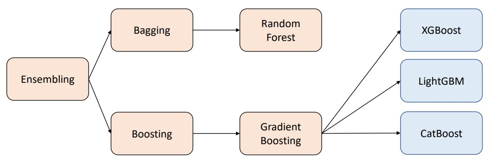
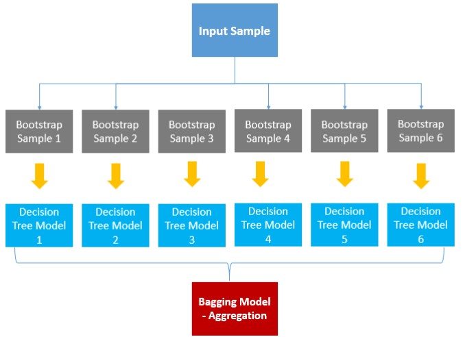
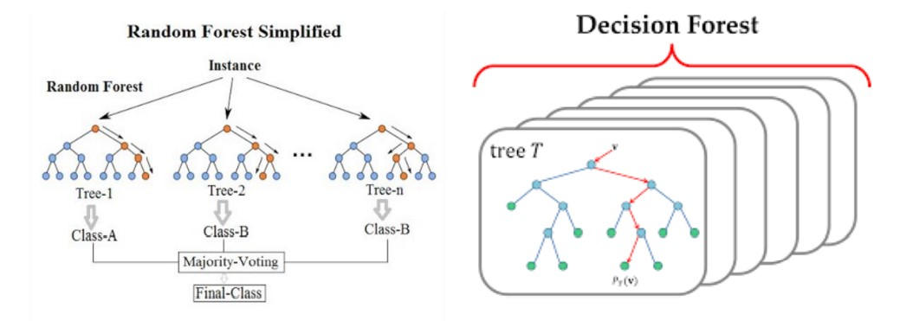
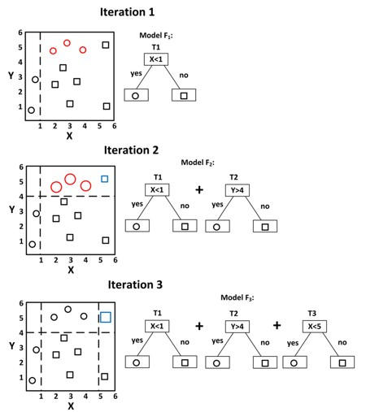
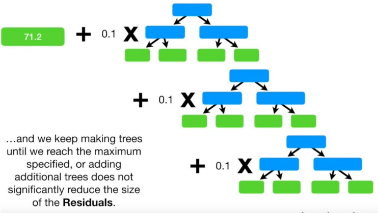
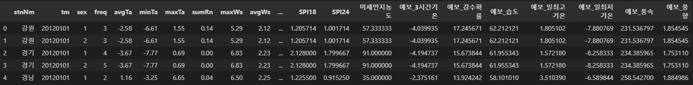

# Ensemble

1. Ensemble
2. **Bagging & random Forest** (●)
3. **Boosting-based Ensemble** (●)

---

1. 앙상블이란? 
- 어떤 데이터의 값을 예측할 때, 주로 하나의 모델만을 사용한다. 만약, 여러 개의 모델을 조화롭게 학습시켜 해당 모델들의 예측 결과를 이용한다면 더 정확한 예측값을 구할 수 있을 것이다라는 생각에서부터 앙상블은 시작된다. 

- 앙상블 학습에서의 핵심은 여러 개의 약 분류기(Weak Learner)를 결합해 하나의 강 분류기(Strong Learner)를 만드는 것이다. 

- 앙상블 학습은 크게 Bagging & Boosting 두 가지로 나뉜다. 

<p align='center'></p>

2-1. Bagging 
- Bagging은 Booststrap Aggregation의 약자로 한 데이터 셋에서 샘플을 복원 추출하여 여러 데이터 셋인 Bootstrap을 만들어 각 모델을 학습시켜 결과물을 집계(Aggregation)하여 최종 결과 값을 만드는 방법이다. 

- 처음 Bagging을 접하게 되면 복원 추출이라는 말이 생소하게 다가올 수 있는데, 복원 추출과 비교해서 살펴볼 용어는 비복원 추출이다. 복원 추출은 한 번 시행한 결과를 다시 얻을 수 있도록 모집단에 다시 포함시켜 추출하는 방법이고 비복원 추출은 그 반대를 뜻한다. 

- 모델의 결과가 만약 범주 형태라면 투표 방식(Voting)으로 결과를 집계하고, 연속적인 수치형 데이터라면 평균으로 집계를 진행한다. 

- 이번 tutorial에서는 bagging하면 대표적인 방법인 random forest를 사용할 것이다.

<p align='center'></p>

2-2. Random Forest
- 랜덤 포레스트는 과적합을 방지하기 위해서 최적의 기준 변수를 임의로 선택하는 머신러닝 기법으로 여러 개의 의사결정나무를 만들고 그 모습이 마치 숲을 이루는 것과 같다고 하여 Random Forest라는 이름이 붙었다. 

- Bootstrapping을 통해 데이터 셋을 형성할 때 선택되지 않은 변수들이 있다면 해당 변수들을 모은 집합은 Out of Bag (OOB)로 설정하여 validation을 진행할 때 사용한다.

<p align='center'></p>

3-1. Boosting 

- Boosting도 마찬가지로 여러 약한 분류기가 합쳐져 강한 분류기를 사용해 최종 모델로 사용한다. 

- 즉, 여러 개의 모델이 존재할 때 순차적으로 학습-예측을 진행하면서 이전에 학습된 알고리즘의 예측이 틀린 데이터를 올바르게 예측할 수 있도록 그 다음 알고리즘에 가중치를 부여하여 학습과 예측을 진행하는 방법이다. 

<p align='center'></p>

3-2. XGBoost, LightGBM, CatBoost

- Boosting의 대표적인 방법으로 Gradient Boosting Machine (GBM)이 존재한다. 그리고 GBM의 단점을 개선한 여러 모델이 XGBoost, LightGBM, CatBoost가 있다. 먼저 GBM은 약한 학습기를 잔차 자체에 적합하고, 이전의 예측값에 예측한 잔차를 더해 주어 해당 값을 다음 모델의 target으로 삼아 학습을 진행한다. 결국 최종 강한 분류기에서 나오는 예측값을 초기화 모형과 더해 최종 결과값으로 산출한다.

<p align='center'></p>

- *XGBoost* : 이러한 GBM은 과적합 문제, 느린 속도와 같은 여러 문제가 존재한다. *XGBoost*는 이러한 문제점을 보완해 GBM보다 빠른 속도, 과적합 방지를 규제하기 위한 파라미터가 존재한다. 

- *LightGBM* : *LightGBM*의 경우 기존 XGBoost와의 차이점은 트리 분할 방식에 있다. 먼저 *XGBoost*의 경우 균형 트리 분할 방식을 사용하고 *LightGBM*의 경우 리프 중심 트리 분할 방식을 사용한다. 이러한 리프 중심 트리 분할 방식은 균형 트리 분할 방식에 비해 예측 오류 손실을 최소화할 수 있다는 장점이 존재한다. 

- *CatBoost* : 마지막으로 *CatBoost*는 이름에서 유추할 수 있듯이 Cat, category 즉, 범주형 변수가 많은 데이터를 학습할 때 성능이 좋다는 장점이 있다. 특히, XGBoost와 LightGBM에 비해 학습 속도가 더 빠르다는 장점 또한 존재한다. 그리고 앞서 설명했던 두 방법에 비해 하이퍼 파라미터에 덜 민감하다는 장점이 있다. 해당 방식의 경우 XGBoost와 동일하게 균형 트리 분할 방식을 사용한다.

4. 배깅과 부스팅의 차이 
- 배깅은 병렬로 학습이 되는 반면에 부스팅은 순차적으로 학습하는 것이 가장 큰 차이점이다. 

- 즉, 부스팅은 한 번 학습이 끝나면 오답에 대해서는 높은 가중치를 부여하고 정답에 대해서는 낮은 가중치를 부여한다. 오답에 더 집중할 수 있게 해주는 역할을 가중치를 활용해 하게 되는 것이다. 

- 다만, 부스팅은 배깅에 비해 에러가 굉장히 적고 성능이 좋지만 속도가 상대적으로 느리고 과적합될 가능성이 크다. 따라서 상황에 따른 적절한 방법을 선택하여 사용하는 것이 중요하다.

**튜토리얼을 진행하기에 앞서 앙상블이 무엇이고 앙상블에 대표적인 두 방식은 bagging과 boosting을 살펴보았다. 그리고 각 방식에 존재하는 대표적인 방법들에 대해서도 간략하게 알아 보았다. 위에서 언급한 내용들은 간략한 소개이기 때문에 좀 더 정확한 내용을 듣고 싶다면 참조 링크들에서 확인 가능하다.**

---

**Tutorial**

- **개요**
    - 이번 튜토리얼에서 사용할 데이터는 심뇌혈관 질환 발생빈도에 대한 데이터(일별, 성별, 시/도별)와 각 시/도별 대표지역의 예보 데이터(직접 전처리 진행)이다. 

    - 해당 데이터를 통해 최종적으로 예측하고자 하는 대상은 각 지역별 심뇌혈관 발생 빈도이다. 

    - 본 튜터리얼에서는 Ensemble 기법 중 Bagging, Boosting의 대표적인 방법인 Randomforest, XGBoost, LightGBM을 사용하고 추가적으로 Lidge와 Lasso까지 결합한 stacking 기법까지 적용하여 결과를 확인한다.

    - 학습을 진행할 때 사용되는 변수의 수가 많기 때문에 Feature selection 기법 2가지를 적용하여 target에 영향을 주는 변수만을 뽑아 학습과 검증을 진행할 예정이다.

    - 마지막으로 사후분석에 자주 사용되는 explainable AI(XAI) 방법론의 하나인 SHAP를 사용하여 모델이 중요하게 보는 변수와 해당 변수의 영향력에 대한 분석을 진행한다. 

- **데이터** 

    - 학습에 사용되는 데이터의 수는 총 49674개이며 변수의 수는 총 48개이다. 
    - 검증에 사용되는 데이터의 수는 총 12444개이며 변수의 수는 동일하다.
    - 변수는 지역명, 성별, 최고 기온, 최저 기온, 평균 강수량, 체감 온도, 총 인구수, 각 나이대별 인구수, 예보 데이터(풍속, 풍향, 기온..) 등이 사용된다. 

    <p align='center'></p>

    1. 전처리 
        - 먼저, 결측치를 대체하거나 제거하는 작업을 실시한다. 
        - 특히, 세종시의 경우 2012년 7월에 설립되었기 때문에 1월~6월 사이의 데이터는 존재하지 않는다. 이러한 경우 세종시에 남아 있는 데이터는 2012년 7월 이후 데이터를 기준으로 평균값으로 결측치를 대체한다. 
        - 이외에 지역별로 결측값이 존재한다면 주변 지역의 데이터를 사용해 K-means를 사용해 결측값을 대체한다. 
        - 모델 학습의 입력으로 사용하기 위해서 지역명과 같은 object 형태의 데이터는 labelencoder를 사용해 encoding을 진행한다. 

    ```
    # Simple preprocessing and standardization of train data
    le = LabelEncoder()

    train = pd.read_csv('./data/train.csv') # Replacing Missing values using k-means
    X_train = train.drop(['freq'],axis = 1)
    y_train = train['freq']

    # Used to encode stnNm features
    le.fit(X_train['stnNm'])
    X_train['stnNm'] = le.transform(X_train['stnNm'])

    # Converting to an integer type of feature related to the population 
    for col in X_train.columns:
        if X_train[col].dtype == 'object':
            X_train[col] = X_train[col].apply(lambda x : x.replace(',',''))
            X_train[col] = X_train[col].astype(int)
    ```

    2. Variance Inflation Factors (VIF) & RFE 

        - 독립변수의 수가 48개로 많다보니 독립변수간 상관 관계가 심한 변수는 제외하기 위해 VIF를 사용하여 독립 변수간 상관 관계의 척도를 측정한다. 

        - 간단하게 말하면, VIF는 다중 회귀 모델에서 독립 변수간 상관 관계 유무를 파악하는 척도로서 VIF 수치가 10이 넘으면 다중 공산성이 있다고 판단하고 5가 넘의면 주의 수준으로 판단한다. 

        - vif를 통해 제거된 변수는 총 20개('10대_인구수','총_인구수','40대_인구수','avgTa','20대_인구수','예보_3시간기온','60대_인구수','90대_인구수','체감온도','avgTd','30대_인구수','예보_일최저기온','70대_인구수','minTa','avgTs','50대_인구수','80대_인구수','minTg','maxTa','avgPv')이고 남은 변수 28개의 변수로 학습을 진행한다.

    ```
    def check_vif(dataframe):
        dataframe = add_constant(dataframe)
        vif = pd.DataFrame()
        vif["VIF Factor"] = [variance_inflation_factor(
            dataframe.values, i) for i in range(dataframe.shape[1])]
        vif["features"] = dataframe.columns
        return vif
    
    remove_list = []
    t1 = time.time()
    X_train_vif = X_train.copy()

    for _ in range(1000):
        
        vif = check_vif(X_train_vif)

        if len(vif[vif['VIF Factor'] >=10]) >=1:
            vif_value = round(vif[vif['VIF Factor'] >=10].sort_values('VIF Factor', ascending=False).iloc[0,0],3)
            remove_col = vif[vif['VIF Factor'] >=10].sort_values('VIF Factor', ascending=False).iloc[0,1]

            if (remove_col == 'const') & (vif[vif['VIF Factor'] >=10].shape[0] == 1):
                print('VIF가 10이 넘는 변수가 없습니다. === FOR LOOP을 종료합니다.')
                break

            elif (remove_col == 'const') & (vif[vif['VIF Factor'] >=10].shape[0] != 1):
                vif_value = round(vif[vif['VIF Factor'] >=10].sort_values('VIF Factor', ascending=False).iloc[1,0],3)
                remove_col = vif[vif['VIF Factor'] >=10].sort_values('VIF Factor', ascending=False).iloc[1,1]
                remove_list.append(remove_col)
                X_train_vif.drop(remove_col, axis=1, inplace=True)
                t2 = time.time()
                elapsed_time = t2-t1
                print('VIF값이 '+str(vif_value)+'인 '+remove_col+'이 제거되었습니다. === 현재 총 제거된 변수의 개수는 '+str(len(remove_list))+'개 입니다. === 경과된 시간: '+str(round(elapsed_time/60))+'분')

            else:
                remove_list.append(remove_col)
                X_train_vif.drop(remove_col, axis=1, inplace=True)
                t2 = time.time()
                elapsed_time = t2-t1
                print('VIF값이 '+str(vif_value)+'인 '+remove_col+'이 제거되었습니다. === 현재 총 제거된 변수의 개수는 '+str(len(remove_list))+'개 입니다. === 경과된 시간: '+str(round(elapsed_time/60))+'분')


        else:
            print('VIF가 10이 넘는 변수가 없습니다. === FOR LOOP을 종료합니다.')
            break

    vif_col = X_train_vif.columns.to_list()
    test_vif = test[vif_col]

    print(vif_col)

    ### output 
    VIF값이 inf인 10대_인구수이 제거되었습니다. === 현재 총 제거된 변수의 개수는 1개 입니다. === 경과된 시간: 0분
    VIF값이 40779.5인 총_인구수이 제거되었습니다. === 현재 총 제거된 변수의 개수는 2개 입니다. === 경과된 시간: 0분
    VIF값이 1947.383인 40대_인구수이 제거되었습니다. === 현재 총 제거된 변수의 개수는 3개 입니다. === 경과된 시간: 0분
    VIF값이 1871.255인 avgTa이 제거되었습니다. === 현재 총 제거된 변수의 개수는 4개 입니다. === 경과된 시간: 0분
    VIF값이 1400.256인 20대_인구수이 제거되었습니다. === 현재 총 제거된 변수의 개수는 5개 입니다. === 경과된 시간: 0분
    VIF값이 1300.126인 예보_3시간기온이 제거되었습니다. === 현재 총 제거된 변수의 개수는 6개 입니다. === 경과된 시간: 0분
    VIF값이 651.233인 60대_인구수이 제거되었습니다. === 현재 총 제거된 변수의 개수는 7개 입니다. === 경과된 시간: 0분
    VIF값이 421.694인 90대_인구수이 제거되었습니다. === 현재 총 제거된 변수의 개수는 8개 입니다. === 경과된 시간: 0분
    VIF값이 412.492인 체감온도이 제거되었습니다. === 현재 총 제거된 변수의 개수는 9개 입니다. === 경과된 시간: 0분
    VIF값이 277.595인 avgTd이 제거되었습니다. === 현재 총 제거된 변수의 개수는 10개 입니다. === 경과된 시간: 0분
    VIF값이 176.414인 30대_인구수이 제거되었습니다. === 현재 총 제거된 변수의 개수는 11개 입니다. === 경과된 시간: 1분
    VIF값이 104.127인 예보_일최저기온이 제거되었습니다. === 현재 총 제거된 변수의 개수는 12개 입니다. === 경과된 시간: 1분
    VIF값이 97.605인 70대_인구수이 제거되었습니다. === 현재 총 제거된 변수의 개수는 13개 입니다. === 경과된 시간: 1분
    VIF값이 94.824인 minTa이 제거되었습니다. === 현재 총 제거된 변수의 개수는 14개 입니다. === 경과된 시간: 1분
    VIF값이 40.373인 avgTs이 제거되었습니다. === 현재 총 제거된 변수의 개수는 15개 입니다. === 경과된 시간: 1분
    VIF값이 33.283인 50대_인구수이 제거되었습니다. === 현재 총 제거된 변수의 개수는 16개 입니다. === 경과된 시간: 1분
    VIF값이 26.77인 80대_인구수이 제거되었습니다. === 현재 총 제거된 변수의 개수는 17개 입니다. === 경과된 시간: 1분
    VIF값이 26.576인 minTg이 제거되었습니다. === 현재 총 제거된 변수의 개수는 18개 입니다. === 경과된 시간: 1분
    VIF값이 21.878인 maxTa이 제거되었습니다. === 현재 총 제거된 변수의 개수는 19개 입니다. === 경과된 시간: 1분
    VIF값이 11.304인 avgPv이 제거되었습니다. === 현재 총 제거된 변수의 개수는 20개 입니다. === 경과된 시간: 1분
    VIF가 10이 넘는 변수가 없습니다. === FOR LOOP을 종료합니다.

    vif를 사용해서 제거하고 남은 변수 : 
    ['stnNm', 'tm', 'sex', 'sumRn', 'maxWs', 'avgWs', 'minRhm', 'avgRhm', 'avgPa', 'avgPs', '10세이하_인구수', '100세이상_인구수', 'SPI1', 'SPI2', 'SPI3', 'SPI4', 'SPI5', 'SPI6', 'SPI9', 'SPI12', 'SPI18', 'SPI24', '미세먼지농도', '예보_강수확률', '예보_습도', '예보_일최고기온', '예보_풍속', '예보_풍향']
    ```

    - Recursive Feaature Elimination (RFE) - 설명    


    3. 모델링
        - 학습을 위해 사용한 모델은 XGBoost, Random Forest, LightGBM, Stacking(XGBoost, Random Forest, LightGBM, Ridge, Lasso)이다. 
        - 각 모델 별 성능 확인 이후 최종 가장 좋은 성능을 나타내는 모델에 대해 shap 방법론을 사용해 사후 분석을 진행할 예정이다. 
        - 각 모델의 하이퍼 파라미터 튜닝을 위해 optuna 기법을 적용해서 최적의 파라미터를 산출하는 것도 포함한다.
        - LGBM의 경우 튜닝하는 하이퍼 파라미터는 learning rate, num_leaves, colsample_bytree, subsample, max_depth, min_child_sample, reg_alpha, reg_lambda, cat_smooth, min_split_gain, max_bin, boosting_type, bagging_fraction, bagging_freq으로 최적의 파라미터 탐색을 진행한다. 
        - 특히, 어느 정도 깊이일 때가 최적일지에 대한 것도 확인해보려 한다. 

    ```
    def lgb_objective(trial):
        lgb_learning_rate = trial.suggest_float('learning_rate', 0.04, 0.4)
        lgb_leaves= trial.suggest_int('num_leaves', 10, 1000)
        lgb_bytree = trial.suggest_float("colsample_bytree", 0.1,0.3)
        lgb_subsample = trial.suggest_float("subsample", 0.1,0.3)
        lgb_depth =  trial.suggest_int('max_depth', 3, 100)
        lgb_child_samples = trial.suggest_int('min_child_samples', 3, 2000)
        lgb_alpha =  trial.suggest_loguniform('reg_alpha', 1e-8, 10.0)
        lgb_lambda = trial.suggest_loguniform('reg_lambda', 1e-8, 1.0)
        lgb_smooth = trial.suggest_int('cat_smooth', 1, 100)
        lgb_gain_to_split = trial.suggest_float('min_split_gain', 0.0, 30.0)
        lgb_max_bin = trial.suggest_int('max_bin',2,100)
        lgb_boosting = trial.suggest_categorical('boosting_type', ['gbdt','dart'])
        lgb_bagging = trial.suggest_uniform('bagging_fraction', 0.1, 1.0)
        lgb_bagging_freq =  trial.suggest_int('bagging_freq', 0, 15)

        regressor_obj = LGBMRegressor(boosting_type=lgb_boosting,objective='regression', metric='rmse', verbosity = -1,num_leaves=lgb_leaves,learning_rate=lgb_learning_rate
                                    ,colsample_bytree= lgb_bytree, subsample=lgb_subsample, max_depth=lgb_depth, min_child_samples=lgb_child_samples,reg_alpha=lgb_alpha,
                                    reg_lambda=lgb_lambda,cat_smooth=lgb_smooth,min_split_gain=lgb_gain_to_split,max_bin = lgb_max_bin
                                    ,bagging_fraction=lgb_bagging,bagging_freq=lgb_bagging_freq)
                                

        rmse = np.sqrt(-cross_val_score(regressor_obj, X_train, y_train, scoring="neg_mean_squared_error", cv = 12, n_jobs=8))
        rmse =  np.mean(rmse)
        return rmse

    def LGBMregreesr(trials):
        sampler = TPESampler(seed=42) # TPESampler --> MAE가 최소가 되는 방향으로 학습 진행 (MAE: 평균절대오차!)

        study_lgb = optuna.create_study(direction='minimize', sampler=sampler)
        study_lgb.optimize(lgb_objective, n_trials=trials)

        print("Number of finished trials: {}".format(len(study_lgb.trials)))

        print("Best trial:")
        trial = study_lgb.best_trial

        print("  Value: {}".format(trial.value))

        print("  Params: ")
        for key, value in trial.params.items():
            print("    {}: {}".format(key, value))
        
        return study_lgb
    ```

    4. 검증 및 평가 
        - 학습이 끝난 XGBoost, LGBM, Random Forest, Stacking 예측 모델에 검증 데이터를 이용하여 예측을 진행하고 예측값과 실제값간에 성능 평가를 진행한다.
        - 평가를 위해 RMSE, MSE, MAE, RMSE를 사용한다. 
        - 각 결과는 아래 표와 같다.
        - 
    5. 사후 분석
        
    6. 결론

**Reference**
- swallow.github.io
- https://julie-tech.tistory.com/119
- https://tyami.github.io/machine%20learning/ensemble-1-basics/
- https://bkshin.tistory.com/entry/%EB%A8%B8%EC%8B%A0%EB%9F%AC%EB%8B%9D-11-%EC%95%99%EC%83%81%EB%B8%94-%ED%95%99%EC%8A%B5-Ensemble-Learning-%EB%B0%B0%EA%B9%85Bagging%EA%B3%BC-%EB%B6%80%EC%8A%A4%ED%8C%85Boosting
- https://assaeunji.github.io/machine%20learning/2020-09-05-gbm/
- https://bioinformaticsandme.tistory.com/167