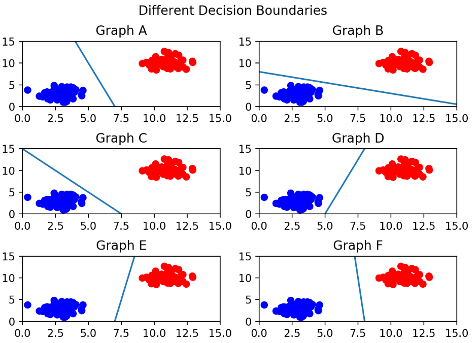
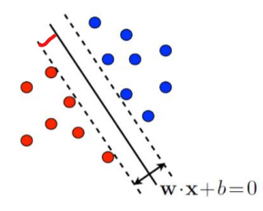
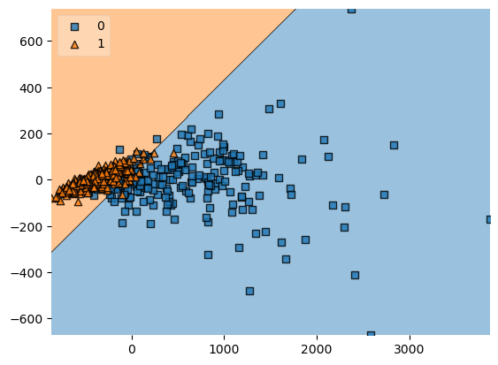
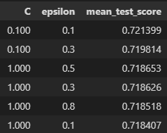
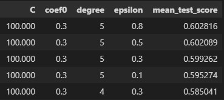
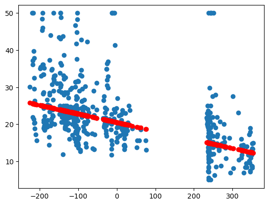
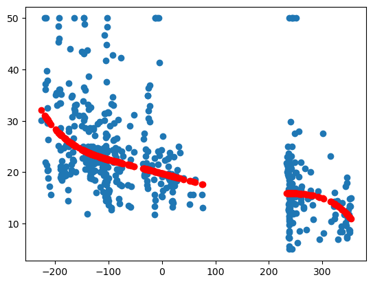

# Kernel based Learning 

1. SVC vs SVR 
2. FDA (LDA) vs KFD 
3. PCA vs KPCA

---

## 1. SVC vs SVR 

`SVC` 
: Support Vector Classification (SVC) refers to a powerful machine learning supervised learning model (SVM) that can be used for classification tasks. Another expression is a model that defines a decision boundary that is a baseline for classification. Therefore, it is important how we define decision boundaries. Often, the optimal decision boundary for classifying data in which two classes exist is the decision boundary with the longest distance between the two classes. In the figure below, Figure F can be seen as the optimal decision boundary.

`what is a Support Vector?` 
: In conclusion, it can be seen that the decision boundary should be as far away from the data set as possible. In a real support vector machine, the support vector refers to the data points that are close to the decision boundary. This is used to define the decision boundary, and the term you need to know at this time is the margin.
<p align='center'></p>

`What is Margin?` 
: Margin is the distance between the decision boundary and the support vector. In the figure below, if the solid line is the decision boundary, the distance between the solid line and the dotted line is the margin, and the decision boundary that maximizes the margin is the optimal decision boundary.

<p align='center'></p>

`Tutorial`
```
def main():
    args = get_args()

    if args.model == 'svc':
        dataset = d.load_breast_cancer()
        model = SVC(args,dataset)
        model.cross_validation()
        best_params = model.fine_tuning()
        model.showplt2(best_params)
    else: 
        dataset = d.load_boston()
        model = SVR(args,dataset)
        model.regression()
        result, best_params = model.gridSearch()
        print('optimal hyperparameter',result)
        model.showplt(best_params)

if __name__ == '__main__':
    main()
```

[SVC - Python Tutorial](https://github.com/junginkim23/Business_Analytics_tutorial/blob/master/Kernel_based_learning/utils/svc.py)

1. Cross Validation
- It was confirmed that the data set used was more suitable for linear separation.
```
def cross_validation(self):
        X,y = self.dataset.data, self.dataset.target
        svm_clf = svm.SVC(kernel=self.args.kernel)
        print(pd.DataFrame(cross_validate(svm_clf,X,y,cv=6)))
        print('Cross-validation result average:', cross_val_score(svm_clf,X,y,cv=6).mean())

------Output------
# linear SVC 
fit_time  score_time  test_score
0  0.501264    0.002000    0.968421
1  1.562880    0.001031    0.905263
2  0.562559    0.001999    0.957895
3  0.943390    0.002002    0.957895
4  0.309034    0.001970    0.936842
5  0.648736    0.001997    0.968085
Cross-validation result average: 0.9490668159761105

# SVC Using Kernel trick (polynomial)
 fit_time  score_time  test_score
0  0.003661    0.001000    0.863158
1  0.003000    0.001001    0.842105
2  0.003000    0.002001    0.926316
3  0.002999    0.002000    0.936842
4  0.004001    0.001000    0.957895
5  0.003999    0.001000    0.925532
Cross-validation result average: 0.9086412840612169
```
2. Parameter tuning using optuna 
```
def parameter_tuning(self):
        def objective(trial):

            if self.args.kernel == 'linear':
                svc_c = trial.suggest_float('C',1e-4,1e2,log=True)
                classifier_obj = svm.SVC(C=svc_c, gamma='auto',kernel=self.args.kernel)
            else : 
                svc_c = trial.suggest_float('C',1e-4,1e-2,log=True)
                svc_degree = trial.suggest_int('degree',3,5,step=1)
                # svc_gamma = trial.suggest_categorical('svc_gamma',['scale','auto'])
                svc_coef = trial.suggest_float('coef0',0.0,0.3,step=0.1)
                classifier_obj = svm.SVC(C=svc_c, gamma='auto',degree=svc_degree,coef0=svc_coef,kernel=self.args.kernel)

            X,y = self.dataset.data,self.dataset.target 
            X_train,X_val,y_train,y_val = sklearn.model_selection.train_test_split(X,y,random_state=0)
            
            classifier_obj.fit(X_train,y_train)
            y_pred = classifier_obj.predict(X_val)

            accuracy = sklearn.metrics.accuracy_score(y_val,y_pred,normalize=True)
            return accuracy
            
        warnings.filterwarnings('ignore')
        study = optuna.create_study(direction='maximize')
        study.optimize(objective,n_trials=100)

        print(f'-----------{self.args.kernel}-----------')
        print('Optimal hyperparameter among 100 trials:',study.best_trial.params)
        print('Highest accuracy among 100 trials:',study.best_trial.value)

        return study.best_params

------Output------
# linear SVC 
-----------linear-----------
Optimal hyperparameter among 100 trials: {'C': 36.60317395134434}
Highest accuracy among 100 trials: 0.972027972027972

# SVC Using Kernel trick (polynomial)
-----------poly-----------
Optimal hyperparameter among 100 trials: 
Highest accuracy among 100 trials: 
```

3. show plot 
```
def showplt2(self,best_params):
        X,y = self.dataset.data, self.dataset.target
        pca = PCA(n_components=2)
        pca_X = pca.fit_transform(X)

        if self.args.kernel == 'linear':
            model_best_params = best_params
            model_best_params['kernel'] = 'linear'
            model_best_params['gamma'] = 'auto'
            model = svm.SVC(**model_best_params)
        else :
            pass

        model.fit(pca_X,y)

        plot_decision_regions(X=pca_X,y=y, clf=model, legend=2)
        plt.show()
```
`linear SVC`
<p align='center'></p>

`SVC Using Kernel trick (polynomial)`
<!-- <p align='center'></p> -->


`SVR`
: SVR (Support Vector Regression) refers to an SVM model that can be used for regression problems. In SVC, the goal was to set the decision boundary that maximizes the margin as the optimal decision boundary and to find the decision boundary. That is, the purpose of SVR is to find a regression equation that flattens the regression equation by reducing the size of the regression coefficient, but considers the difference between the actual value and the estimated value to be small.

[SVR - Python Tutorial](https://github.com/junginkim23/Business_Analytics_tutorial/blob/master/Kernel_based_learning/utils/svr.py)

1. Regression
```
def regression(self):
        X,y = self.dataset.data, self.dataset.target 
        X_train,X_val,y_train,y_val = sklearn.model_selection.train_test_split(X,y,random_state=0)
        
        if self.args.kernel =='linear':
            svm_reg = svm.SVR(kernel=self.args.kernel,C=1.0,epsilon=0.1)
            svm_reg.fit(X_train,y_train)
        else :
            svm_reg = svm.SVR(kernel=self.args.kernel,C=1.0,epsilon=0.1,degree=3,coef0=0.1)
            svm_reg.fit(X_train,y_train)

        y_pred = svm_reg.predict(X_val)
        r2 = r2_score(y_val,y_pred)

        print(f'{self.args.kernel} r2_score :{r2}')

------Output------
# linear SVR 
-----------linear-----------
linear r2_score: 0.5635479105806482

# SVR Using Kernel trick (polynomial)
-----------poly-----------
poly r2_score: 0.10397216111777619
```

2. Parameter tuning using gridSearch
- In case of linear SVR, only cost and epsilon parameters were considered. On the other hand, SVR using the kernel trick considers coef, degree, C, and epsilon parameters.

```
def gridSearch(self):
        X,y = self.dataset.data, self.dataset.target
        X_train,X_val,y_train,y_val = sklearn.model_selection.train_test_split(X,y,random_state=0)

        if self.args.kernel == 'linear':
            svm_reg = svm.SVR(kernel='linear')
            svr_parameters = {'C':[0.001,0.01,0.1,1,10,25,50,100],'epsilon':[0.1,0.3,0.5,0.8]}
            grid_svr = GridSearchCV(svm_reg,param_grid=svr_parameters,cv=5,scoring='r2')
            grid_svr.fit(X_train,y_train)
        else:
            svm_reg = svm.SVR(kernel='poly')
            svr_non_parameters = {'C':[0.001,0.01,0.1,1,10,25,50,100],'epsilon':[0.1,0.3,0.5,0.8],'degree':[3,4,5],'coef0':[0.0,0.1,0.2,0.3]}
            grid_svr = GridSearchCV(svm_reg,param_grid=svr_non_parameters,cv=5,scoring='r2')
            grid_svr.fit(X_train,y_train)

        print('optimal parameter:',grid_svr.best_params_)
        print('optimal value:',grid_svr.best_score_)

        result = pd.DataFrame(grid_svr.cv_results_['params'])
        result['mean_test_score'] = grid_svr.cv_results_['mean_test_score']
        result.sort_values(by='mean_test_score',ascending=False)

        return result,grid_svr.best_params_

------Output------
# linear SVR 
-----------linear-----------
Optimal parameter: {'C': 0.1, 'epsilon': 0.1}
Optimal value: 0.7213985360521598

# SVR Using Kernel trick (polynomial)
-----------poly-----------
Optimal parameter: {'C': 100, 'coef0': 0.3, 'degree': 5, 'epsilon': 0.8}
Optimal value: 0.6028161014290282
```
`linear SVR`
<p align='center'></p>

`SVR Using Kernel trick (polynomial)`
<p align='center'></p>

3. show plot 
```
def showplt(self,best_params):
        X,y = self.dataset.data, self.dataset.target
        pca = PCA(n_components=1)
        pca_X = pca.fit_transform(X)

        ## SVR - linear
        if self.args.kernel=='linear':
            model_best_params = best_params
            model_best_params['kernel'] = self.args.kernel
            model_best_params['gamma'] = 'scale'
            model = svm.SVR(**model_best_params)
        else:
            model_best_params = best_params
            model_best_params['kernel'] = self.args.kernel
            model = svm.SVR(**model_best_params)

        model.fit(pca_X,y)
        y_pred = model.predict(pca_X)

        plt.title(self.args.kernel)
        plt.scatter(pca_X,y)
        plt.scatter(pca_X,y_pred,color='r')
        plt.show()
``` 
`linear SVR`
<p align='center'></p>

`SVR Using Kernel trick (polynomial)`
<p align='center'></p>

### Conclusion
In svc, the breast cancer data set provided by sklearn was used. When both linear SVC and SVC using the polynomial kernel trick were applied, it was confirmed that linear SVC was more suitable for the data set. In this case, accuracy was used as a performance evaluation index. Linear SVC was more suitable when the performance was confirmed by performing parameter tuning.

In SVR, the boston data set provided by sklearn was used. When linear svr and svr using polynomial kernel trick were applied, it was confirmed through r2 score that linear svr expressed the data set better. Unlike in svc, gridsearch was performed when parameter tuning was performed, and it was confirmed that the performance of svr to which the polynomial kernel trick was applied was greatly improved. However, as the linear svr still showed better performance, it was judged that the linear svr is more suitable for the data set as well.

## 2. FDA (LDA) vs KFD 

`FDA` 
: Fisher Discriminant Analysis (FDA) is a method of projecting data on a single straight line (one-dimensional space) and then judging whether the projected data is well discriminated. The method judges that the data is more well differentiated as the data are gathered and the centers are farther away from each other. 

`KFD` 
: Kernel Fisher Discriminant Analysis (KFD) differs only in kernelization to the existing FDA. Therefore, it is the same as the existing FDA except that the kernel trick that helps to enable linear separation is used after converting input sample data that cannot be linearly separated into a high-dimensional space using a kernel function.

## 3. PCA vs KPCA 

`PCA` 
: PCA, also called principal component analysis, is widely used as a dimensionality reduction and variable extraction technique. Here, the principal component is the component that best explains the variance of all independent variables. This technique is mainly used to create new variables by combining existing variables because there are too many variables. PCA actually chooses the axis that preserves the variance as much as possible, because the larger the variance, the clearer the differences between the data and the least loss of information.

`KPCA`
: KPCA is different from PCA in that it actually applies the Kernel trick to PCA. It refers to using linear PCA after converting to a high dimension using a Kernel function on a sample or data set that cannot be linearly separated. 