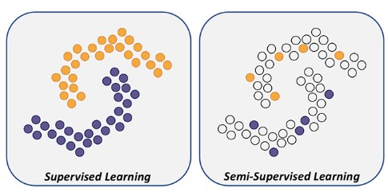
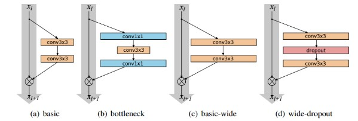

# Semi-supervised Learning 

1. **MixMatch** (●)
2. **FixMatch** (●)
3. **FlexMatch** (●)  

--- 

1. Semi-supervised Learning이란? 
- 준지도 학습은 지도 학습과 비지도 학습의 조합으로 이루어진 학습이다. 
- 해당 학습은 레이블링된 데이터와 레이블링되지 않은 데이터가 모두 사용된다. 
- 준지도 학습의 특징은 한 쪽의 데이터에 있는 추가 정보를 활용해 다른 데이터 학습에서의 성능을 높이는 것을 목표로 한다. 
- 준지도 학습의 장점은 더 많은 데이터의 확보가 가능하다는 것이고 단점으로는 레이블링의 불확실성이 있다는 것이다. 
- 대표적인 방법으로는 Mixmatch, FixMatch, FlexMatch가 존재한다. 

<p align='center'></p>

**준지도 학습의 대표적인 방법론에 대한 한 줄 설명** 

2. [MixMatch](https://github.com/junginkim23/Business_Analytics_tutorial/blob/master/Semi-supervised_Learning/pdf/MixMatch.pdf)
- 기존 준지도 학습 방법 Consistency Regularization, Entropy Minimization, Traditional Regularization (Mix Up)을 결합한 방법론 

3. [FixMatch](https://github.com/junginkim23/Business_Analytics_tutorial/blob/master/Semi-supervised_Learning/pdf/FixMatch.pdf)
- MixMatch와 ReMixMatch의 경우 성능 고도화를 위해 주요 기법들을 추가 및 혼합하는 방향으로 발전함 
- 지나치게 정교한 loss term과 조정하기 어려운 수 많은 사용자 정의 파라미터를 사용하는 형태

4. [FlexMatch](https://github.com/junginkim23/Business_Analytics_tutorial/blob/master/Semi-supervised_Learning/pdf/FlexMatch.pdf)
- 분류가 쉬운 범주의 경우 처음부터 Confidence가 높은 데이터가 다수 Pseudo Labeling이 되어 계속 더 잘 학습할 수 있게 유도되지만 분류가 어려운 범주는 Confidence가 높은 레이블이 없는 데이터가 많지 않기 때문에 비지도 학습의 본 의도인 레이블이 없는 데이터의 정보 활용이 어렵다는 문제가 존재
- 따라서, 모든 클래스에 동일한 Confidence 기준을 적용하지 않고 각 클래스의 난이도에 따른 다른 기준을 적용하는 것이 핵심! 


---

**Tutorial** 

- 본 튜터리얼에서는 MixMatch와 FixMatch 그리고 FlexMatch을 직접 구현하고 최종적으로 성능 비교를 해보려 한다. 실제 이론에서 성능은 FlexMatch > FixMatch > MixMatch로 알려져 있다. 따라서, 실제 이론과 부합하는지 확인하는 것(Top-1 ACC, Top-5 ACC)이 최종 목표이다. README 파일에서는 MixMatch에 관한 코드를 대표적으로 설명하고 FixMatch와 FlexMatch에 관한 코드는 업로드할 예정이다.

- 모든 방법론에 관한 코드는 아래 방법론의 이름을 클릭하면 확인가능하다. 굉장히 많은 내용이 담겨 있어 하나 하나 설명하는데 어려움이 있어 이렇게 링크를 첨부하니 양해바랍니다. 

    - [MixMatch](https://github.com/junginkim23/Business_Analytics_tutorial/blob/master/Semi-supervised_Learning/MixMatch.ipynb)
    - [FixMatch](https://github.com/junginkim23/Business_Analytics_tutorial/blob/master/Semi-supervised_Learning/FixMatch.ipynb)
    - [FlexMatch](https://github.com/junginkim23/Business_Analytics_tutorial/blob/master/Semi-supervised_Learning/FlexMatch.ipynb)

1. 활용 데이터 
- CIFAR-10 : 컬러 이미지들로 구성되어 있고 총 6만개의 샘플을 갖고 있고 그 중 5만개는 훈련을 위한 것이고 1만개는 테스트를 위한 것이다. CIFAR-10의 이미지들은 이름에서 나타나듯이 10개의 클래스에 속하고 해당 클래스는 비행기, 자동차, 새, 고양이, 사슴, 개, 개구리, 말, 배, 트럭으로 구성되어 있다.

<p align='center'></p>

2. Simple Code Review 

    - WideResnet 
        - 등장 배경 : 지금까지, CNN은 깊이를 증가시키는 방향으로 발전해왔다. 예를 들어, AlexNet, VGG, inception, ResNet과 같은 모델이 있다. 모델의 깊이가 깊어지는 만큼 기울기 소실 또는 기울기 폭발과 같은 문제가 발생한다. 이러한 문제를 해결하기 위해 ResNet은 residual block 개념을 제안하였고 이를 통해 뛰어난 성능을 확보할 수 있었다. 하지만 깊이가 아닌 ResNet의 넓이에 따른 정확도 양상을 실험하게 되고 이를 통해 WideResNet이 등장하게 되었다. WideResNet의 실험 결과를 통해 모델의 깊이를 증가시키는 것보다 효과적으로 성능을 향상시킬 수 있다는 점이다. 심지어 학습 속도 또한 몇 배는 빠른 결과를 도출할 수 있었다. 

        - 본 튜터리얼에서는 WideResNet을 사용한다. MixMatch, FixMatch, FlexMatch 모두 동일한 WideResnet 코드를 사용한다. 

        ```
        # BasicBlock을 정의
        class BasicBlock(nn.Module):
            
            def __init__(self, in_planes, out_planes, stride, dropRate=0.0, activate_before_residual=False):
                super(BasicBlock, self).__init__()
                self.bn1 = nn.BatchNorm2d(in_planes, momentum=0.001)
                self.relu1 = nn.LeakyReLU(negative_slope=0.1, inplace=True)
                self.conv1 = nn.Conv2d(in_planes, out_planes, kernel_size=3, stride=stride,
                                    padding=1, bias=False)
                self.bn2 = nn.BatchNorm2d(out_planes, momentum=0.001)
                self.relu2 = nn.LeakyReLU(negative_slope=0.1, inplace=True)
                self.conv2 = nn.Conv2d(out_planes, out_planes, kernel_size=3, stride=1,
                                    padding=1, bias=False)
                self.droprate = dropRate
                self.equalInOut = (in_planes == out_planes)
                self.convShortcut = (not self.equalInOut) and nn.Conv2d(in_planes, out_planes, kernel_size=1, stride=stride,
                                    padding=0, bias=False) or None
                self.activate_before_residual = activate_before_residual
                
            def forward(self, x):
                if not self.equalInOut and self.activate_before_residual == True:
                    x = self.relu1(self.bn1(x))
                else:
                    out = self.relu1(self.bn1(x))
                out = self.relu2(self.bn2(self.conv1(out if self.equalInOut else x)))
                if self.droprate > 0:
                    out = F.dropout(out, p=self.droprate, training=self.training)
                out = self.conv2(out)
                return torch.add(x if self.equalInOut else self.convShortcut(x), out)

            
        # Network Block을 정의
        class NetworkBlock(nn.Module):
            
            def __init__(self, nb_layers, in_planes, out_planes, block, stride, dropRate=0.0, activate_before_residual=False):
                super(NetworkBlock, self).__init__()
                self.layer = self._make_layer(block, in_planes, out_planes, nb_layers, stride, dropRate, activate_before_residual)
                
            def _make_layer(self, block, in_planes, out_planes, nb_layers, stride, dropRate, activate_before_residual):
                layers = []
                for i in range(int(nb_layers)):
                    layers.append(block(i == 0 and in_planes or out_planes, out_planes, i == 0 and stride or 1, dropRate, activate_before_residual))
                return nn.Sequential(*layers)
            
            def forward(self, x):
                return self.layer(x)


        # WideResNet 모델 정의
        class WideResNet(nn.Module):
            
            
            # 위에서 정의한 Basic Block 및 Network Block을 기반으로 Wide ResNet 모델 정의
            
            
            def __init__(self, num_classes, depth=28, widen_factor=2, dropRate=0.0):
                super(WideResNet, self).__init__()
                nChannels = [16, 16*widen_factor, 32*widen_factor, 64*widen_factor]
                assert((depth - 4) % 6 == 0)
                n = (depth - 4) / 6
                block = BasicBlock
                # 1st conv before any network block
                self.conv1 = nn.Conv2d(3, nChannels[0], kernel_size=3, stride=1,
                                    padding=1, bias=False)
                # 1st block
                self.block1 = NetworkBlock(n, nChannels[0], nChannels[1], block, 1, dropRate, activate_before_residual=True)
                # 2nd block
                self.block2 = NetworkBlock(n, nChannels[1], nChannels[2], block, 2, dropRate)
                # 3rd block
                self.block3 = NetworkBlock(n, nChannels[2], nChannels[3], block, 2, dropRate)
                # global average pooling and classifier
                self.bn1 = nn.BatchNorm2d(nChannels[3], momentum=0.001)
                self.relu = nn.LeakyReLU(negative_slope=0.1, inplace=True)
                self.fc = nn.Linear(nChannels[3], num_classes)
                self.nChannels = nChannels[3]

                for m in self.modules():
                    if isinstance(m, nn.Conv2d):
                        n = m.kernel_size[0] * m.kernel_size[1] * m.out_channels
                        m.weight.data.normal_(0, math.sqrt(2. / n))
                    elif isinstance(m, nn.BatchNorm2d):
                        m.weight.data.fill_(1)
                        m.bias.data.zero_()
                    elif isinstance(m, nn.Linear):
                        nn.init.xavier_normal_(m.weight.data)
                        m.bias.data.zero_()

            def forward(self, x):
                out = self.conv1(x)
                out = self.block1(out)
                out = self.block2(out)
                out = self.block3(out)
                out = self.relu(self.bn1(out))
                out = F.avg_pool2d(out, 8)
                out = out.view(-1, self.nChannels)
                return self.fc(out)
        ```

    <p align='center'></p>

    - MixMatch, FixMatch 그리고 FlexMatch에서 사용된 hyperparameter는 argparser를 사용해 저장하였고 그 내용은 아래와 같다. 순서는 MixMatch, FixMatch, FlexMatch 순이다. 
    - 레이블 된 데이터의 수는 하이퍼 파라미터로 지정 가능하고, 실험에서는 4000으로 설정하였다. 5000개(클래스 별 500개)의 데이터 셋은 validation set으로 그리고 나머지는 unlabeled dataset으로 사용하였다.

    ```
    def MixMatch_parser():
        parser = argparse.ArgumentParser(description="MixMatch PyTorch Implementation for BA")
        
        # method arguments
        parser.add_argument('--n-labeled', type=int, default=4000)
        parser.add_argument('--num-iter', type=int, default=1024,
                            help="The number of iteration per epoch")
        parser.add_argument('--alpha', type=float, default=0.75)
        parser.add_argument('--lambda-u', type=float, default=75)
        parser.add_argument('--T', default=0.5, type=float)
        parser.add_argument('--ema-decay', type=float, default=0.999)

        parser.add_argument('--epochs', type=int, default=1024)
        parser.add_argument('--batch-size', type=int, default=64)
        parser.add_argument('--lr', type=float, default=0.002)

        return parser
    ```

    ```
    # Argument 정의
    def FlexMatch_parser():
        parser = argparse.ArgumentParser(description="FlexMatch PyTorch Implementation for BA")
        
        # method arguments
        parser.add_argument('--n-labeled', type=int, default=4000) # labeled dat의 수
        parser.add_argument('--n-classes', type=int, default=10) # Class의 수
        parser.add_argument("--expand-labels", action="store_true", 
                            help="expand labels to fit eval steps")

        # training hyperparameters
        parser.add_argument('--batch-size', type=int, default=64) # 배치 사이즈
        parser.add_argument('--total-steps', default=2**20, type=int) # iteration마다 Scheduler가 적용되기에, Epoch가 아닌, Total-step을 정의
        parser.add_argument('--eval-step', type=int, default=1024) # Evaluation Step의 수
        parser.add_argument('--lr', type=float, default=0.03) # Learning rate
        parser.add_argument('--weight-decay', type=float, default=5e-4) # Weight Decay 정도
        parser.add_argument('--nesterov', action='store_true', default=True) # Nesterov Momentum
        parser.add_argument('--warmup', type=float, default=0.0) # Warmup 정도

        parser.add_argument('--use-ema', action='store_true', default=True) # EMA 사용여부
        parser.add_argument('--ema-decay', type=float, default=0.999) # EMA에서 Decay 정도

        parser.add_argument('--mu', type=int, default=7) # Labeled data의 mu배를 Unlabeled 데이터의 개수로 정의하기 위한 함수 (근데 위 Trainer에서는 안 쓰임)
        parser.add_argument('--T', type=float, default=1.0) # Sharpening 함수에 들어가는 하이퍼 파라미터

        parser.add_argument('--threshold', type=float, default=0.95) # Pseudo-Labeling이 진행되는 Threshold 정의
        parser.add_argument('--lambda-u', type=float, default=1.0) # Loss 가중치 정도
        return parser
    ```

    ```
    # Argument 정의
    def FlexMatch_parser():
        parser = argparse.ArgumentParser(description="FlexMatch PyTorch Implementation for BA")
        
        # method arguments
        parser.add_argument('--n-labeled', type=int, default=4000) # labeled dat의 수
        parser.add_argument('--n-classes', type=int, default=10) # Class의 수
        parser.add_argument("--expand-labels", action="store_true", 
                            help="expand labels to fit eval steps")

        # training hyperparameters
        parser.add_argument('--batch-size', type=int, default=64) # 배치 사이즈
        parser.add_argument('--total-steps', default=2**20, type=int) # iteration마다 Scheduler가 적용되기에, Epoch가 아닌, Total-step을 정의
        parser.add_argument('--eval-step', type=int, default=1024) # Evaluation Step의 수
        parser.add_argument('--lr', type=float, default=0.03) # Learning rate
        parser.add_argument('--weight-decay', type=float, default=5e-4) # Weight Decay 정도
        parser.add_argument('--nesterov', action='store_true', default=True) # Nesterov Momentum
        parser.add_argument('--warmup', type=float, default=0.0) # Warmup 정도

        parser.add_argument('--use-ema', action='store_true', default=True) # EMA 사용여부
        parser.add_argument('--ema-decay', type=float, default=0.999) # EMA에서 Decay 정도

        parser.add_argument('--mu', type=int, default=7) # Labeled data의 mu배를 Unlabeled 데이터의 개수로 정의하기 위한 함수 (근데 위 Trainer에서는 안 쓰임)
        parser.add_argument('--T', type=float, default=1.0) # Sharpening 함수에 들어가는 하이퍼 파라미터

        parser.add_argument('--threshold', type=float, default=0.95) # Pseudo-Labeling이 진행되는 Threshold 정의
        parser.add_argument('--lambda-u', type=float, default=1.0) # Loss 가중치 정도
        return parser
    ```

    - CIFAR-10 데이터 셋을 사용하였고 레이블 된 데이터의 수는 4000개(하이퍼 파라미터로 설정 가능), 5000개(클래스 별 500개)는 validation set, 그리고 나머지는 unlabeled dataset으로 사용 
    - 최종적인 결과는 Top-1 ACC와 Top-5 ACC, 두 평가 지표를 활용하여 각 방법론의 성능을 확인한다. 
        - Top-1 ACC : (확률 값이 가장 높은 범주와 실제 범주가 일치하는 관측치 수)/ 전체 관측치
        - Top-5 ACC : (확률 값 상위 5개 중 실제 범주가 존재하는 관측치 수)/ 전체 관측치
            | Model | Top-5 Accuracy | Top-1 Accuracy | 
            |-------|--------------|--------------|
            |MixMatch|  1.604/1.597 | 0.913/0.911  |
            |FixMatch|  99.24% | 83.88% |
            |FlexMatch|  99.34% | 84.35%  |
    

    - 총 30 epoch마다 train, valid, test를 진행하였고 마지막 30 epoch에서의 결과를 표로 작성하였다. 실제 이론에서는 FlexMatch > FixMatch > MixMatch 순으로 성능이 좋았고 CIFAR-10 데이터 셋으로 실험을 돌려봤을 때 동일한 결과를 얻을 수 있었다. 
    - 실제 이론상에서도 MixMatch의 경우 성능 고도화를 위해 주요 기법들을 추가 및 혼합하는 방향으로 발전하였고 이는 지나치게 정교한 loss term과 조정하기 어려운 수많은 하이퍼 파라미터를 사용하는 형태로서 복잡성이 굉장히 높아졌다. 이러한 문제점을 개선하기 위해 FixMatch에서는 Consistency Regularization과 Pseudo Labeling 두 기법만을 결합한 간단한 구조를 사용하였다. 결국 이론적으로도 방법론 자체가 간단해지면서 더 높은 성능을 보이는 것을 확인할 수 있었다. 즉, 이론적으로 효과적이라는 것을 확인하였다. 하지만, FixMatch 또한 분류가 쉬운 범주의 경우 처음부터 Confidence가 높은 데이터가 다수 Pseudo Labeling이 되어 계속 더 잘 학습할 수 있게 유도되지만, 분류가 어려운 범주는 Confidence가 높은 레이블이 없는 데이터가 많지 않기 때문에 비지도 학습의 본 의도인 레이블이 없는 데이터의 정보 활용이 어렵다는 한계가 존재한다. 이러한 한계점을 개선하기 위해 모든 클래스에 동일한 Confidence 기준을 적용하지 않고 각 클래스의 난이도에 따른 다른 기준을 적용한 방법론이 바로 FlexMatch이다. 결국 이론상으로는 MixMatch의 한계점을 개선한 FixMatch가 더 높은 성능을 보일 것이고 FixMatch의 한계점을 개선한 FlexMatch가 더 높은 성능을 보일 것에 대해 실험을 통해 확인하였다. 